# Tatjana Marković PackBan Trello Clone app
## Table of contents

  - [Overview](#overview)
  - [The challenge](#the-challenge)
  - [Screenshot](#screenshot)
  - [Links](#links)
  - [My process](#my-process)
  - [Built with](#built-with)
  - [Author](#author)

## Overview
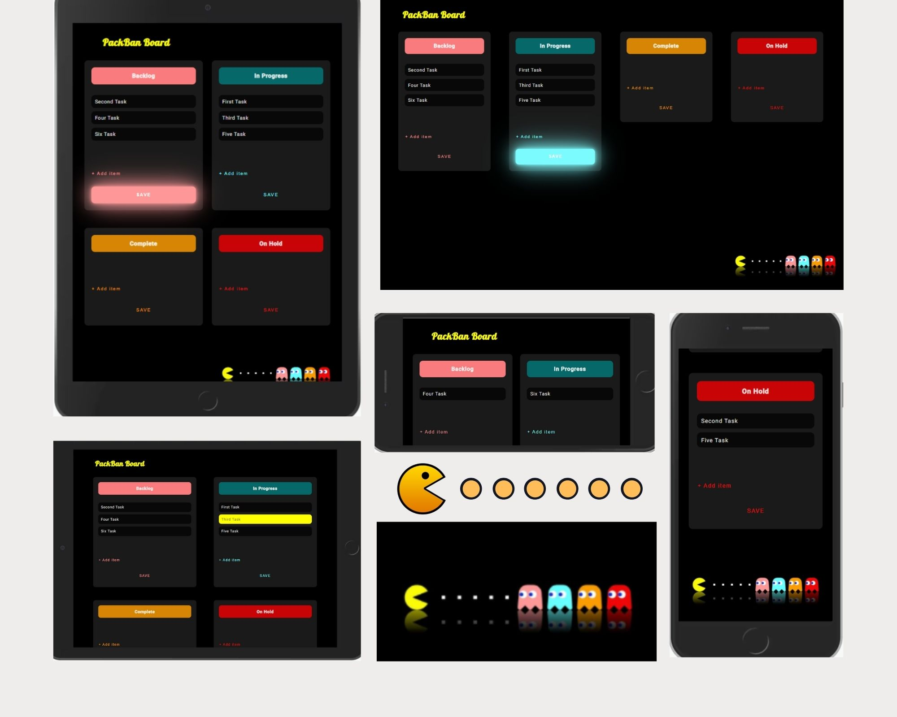

- On first load 
  1. On screen Board with 4 columns without tasks.

Features:
- Add Item and Save Item functionality within each column.
- Reorder elements within a column and between different columns.
- Show changes when refreshing the page.
## The challenge

It is necessary to make a Trello clone; visual design (colors, fonts, etc.) is free to choose, it is only important to be responsive. Also, you can use any UI library / framework (Bootstrap, MaterialUI, Tailwind, etc.)
** For the "Drag and Drop" functionality itself it is necessary to use 

Requirements:
- 4 columns (eg Backlog, In Progress, Complete, On Hold)
- Add Item and Save Item functionality within each column.
- Reorder elements within a column and between different columns.
- Show changes when refreshing the page.
### Screenshot

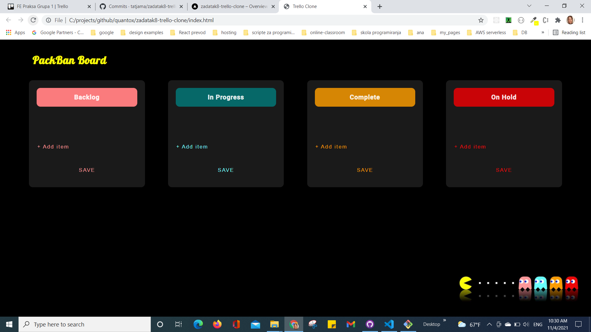
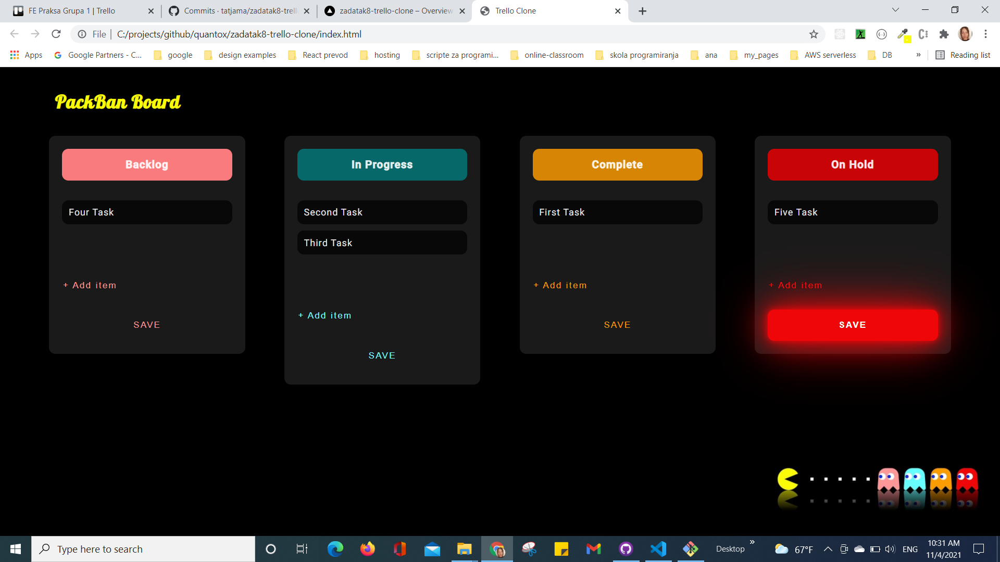
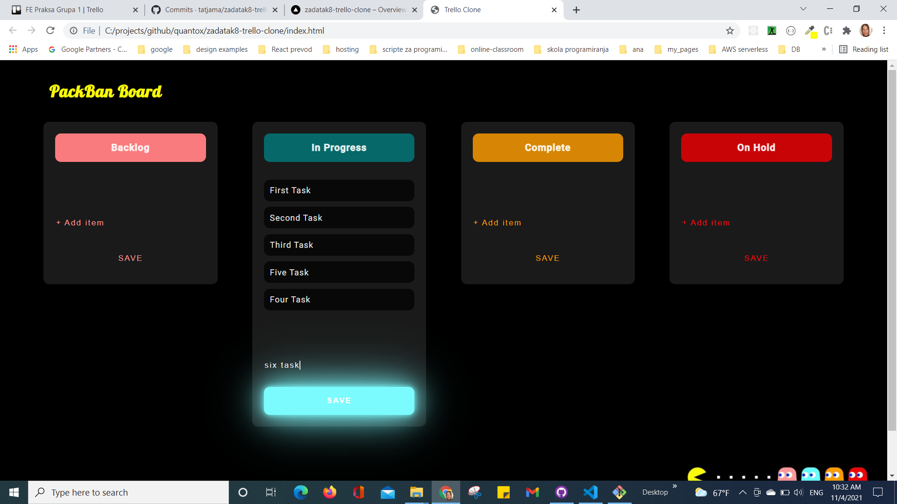
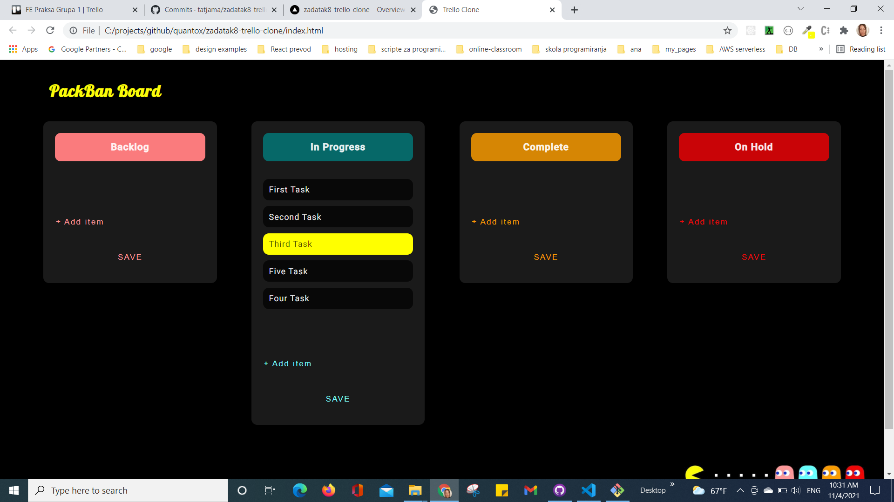
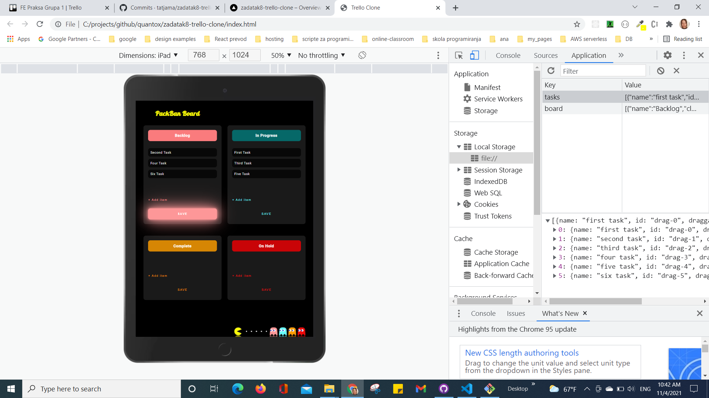
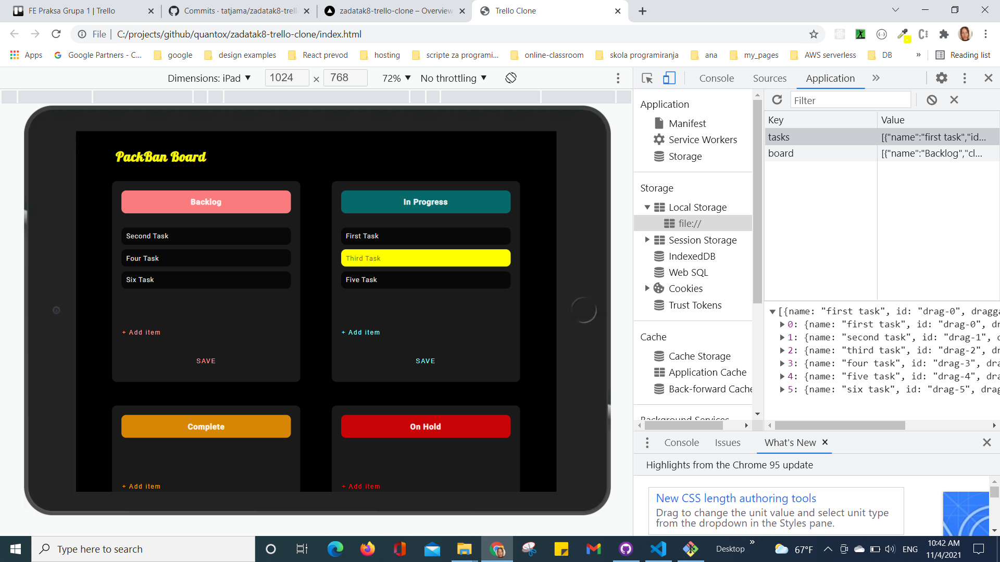
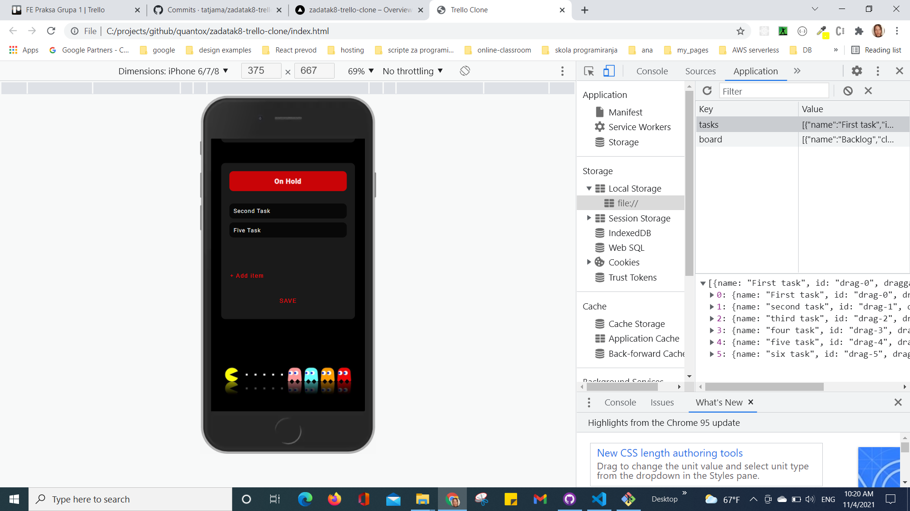
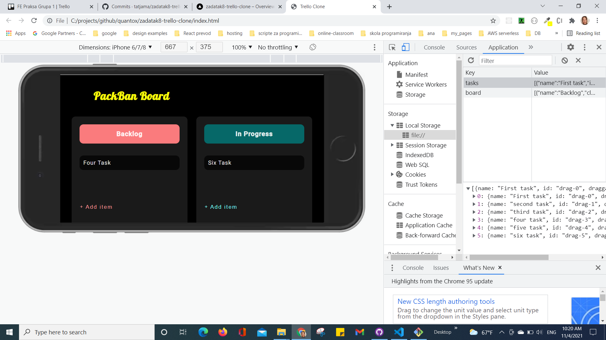
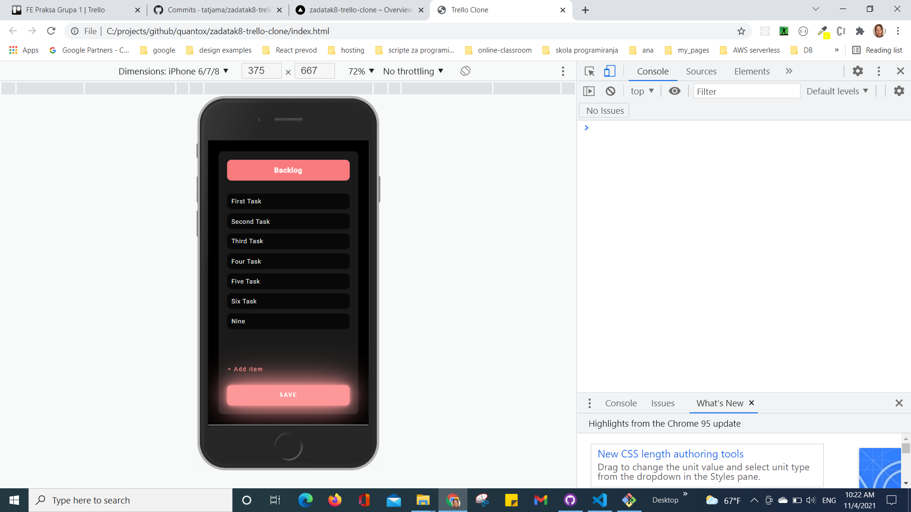
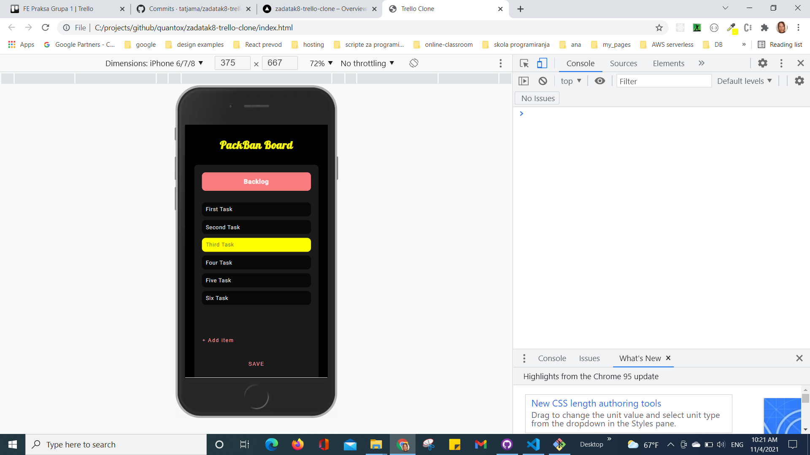

### Links

- Solution URL: [GitHub](https://github.com/tatjama/zadatak8-trello-clone/tree/develop)
- Preview: [Vercel](https://zadatak8-trello-clone-d7tlbkc3c-tatjana.vercel.app/)
- Live Site URL: [Vercel](https://zadatak8-trello-clone.vercel.app/)

## My process

1. Create a new project
2. Initializing git repositories main and develop
3. Import git repositories to the Vercel project
4. Create HTML structure
5. Create CSS Utility
6. Style for Desktop
7. Responsive Mobile
8. Create JavaScript  drag&drop
9. Create JavaScript add new task
10. Manual Test for bugs
11. Create screenshots
12. Change README-template.md to README.md
13. Open Pull request
14. Solve Issue
15. Merge develop branch into master branch
### Built with

1. Semantic HTML5 markup
2. CSS custom properties
- FlexBox
- Media queries
- Centering elements, content and text
- Element positioning
- Customize font,width and size
- Hover
- CSS variables
- gradient
3. JavaScript
- DOM manipulation   
- Event handling
- OOP javaScript
- Local Storage
## Author

- Website - [Tatjana Markovic](https://my-react-portfolio-tatjana.vercel.app/)
- LinkedIn - [Tatjana Marković](https://www.linkedin.com/in/tatjana-markovi%C4%87-919501189/)
- GitHub - [tatjama](https://github.com/tatjama)